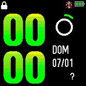

 

# Watchface for Amazfit Bip

<p align="center">
	
</p>


## Unpacking .bin

#### Linux / Mac
```bash
python dial2img.py -u -i 7e16e26c268d_packed.bin
```


#### Windows
```
Watchface.exe 7e16e26c268d_packed.bin
```

## Package to .bin

- Create folder with the image files inside and the JSON. The name of the folder, as well as the name of the JSON file must be the same.

#### Linux / Mac
```bash
cd 5c8916e440e6d/
python dial2img.py -p -i 7e16e26c268d_packed.bin
```


#### Windows
```
Watchface.exe 7e16e26c268d/7e16e26c268d.json
```

## What colors can I use in the images?
*Note: The color palette is limited, with the following*


-   **Black**  0x000000
-   **Blue**  0x0000FF
-   **Green**  0x00FF00
-   **Red**  0xFF0000
-   **Cyan**  0x00FFFF
-   **Purple**  0xFF00FF
-   **Yellow**  0xFFFF00
-   **White**  0xFFFFFF
-   **Transparent**  0xFEFE00

### Define background image
```
"Background": {
    "Image": {
      "X": 0,
      "Y": 0,
      "ImageIndex": 0 // We tell you that the image will be called 000.png
    }
  },
```
### We define the time
```
"Time": {
    "Hours": {
      "Tens": {
        "X": 2, // position on the shaft XY
        "Y": 3,
        "ImageIndex": 1, // we will indicate that the tens of hours
        "ImagesCount": 3 // will start in the image 001.png up the image 003.png
      },
      "Ones": {
        "X": 41, // position on the shaft XY
        "Y": 3,
        "ImageIndex": 4, // we will indicate that the units of the hours
        "ImagesCount": 10 // will start in the image 004.png up the image 013.png
      }
    },
    "Minutes": {
      "Tens": {
        "X": 2, // position on the shaft XY
        "Y": 60,
        "ImageIndex": 14, // we will indicate that the units of the minutes
        "ImagesCount": 10 // will start in the image 014.png up the image 023.png
      },
      "Ones": {
        "X": 41, // position on the shaft XY
        "Y": 60,
        "ImageIndex": 14, // we will indicate that the units of the minutes
        "ImagesCount": 10 // will start in the image 014.png up the image 023.png
      }
    }
  },
```

### We define the data of the activities
* Steps
```
"Activity": {
    "Steps": {
      "TopLeftX": 64, // positioning using distances
      "TopLeftY": 158, // to the different corners
      "BottomRightX": 101,
      "BottomRightY": 168,
      "Alignment": "TopLeft",
      "Spacing": 2,
      "ImageIndex": 24, // the images of the counters
      "ImagesCount": 10 // will start in the image 024.png up the image 033.png
    },
```

* Pulse
```
"Pulse": {
      "TopLeftX": 23, // positioning using distances
      "TopLeftY": 158, // to the different corners
      "BottomRightX": 44,
      "BottomRightY": 168,
      "Alignment": "TopLeft",
      "Spacing": 2,
      "ImageIndex": 24, // the images of the counters
      "ImagesCount": 10 // will start in the image 024.png up the image 033.png
    }
```

* Weather
```
"Weather": {
    "Icon": {
      "CustomIcon": {
        "X": 81,
        "Y": 75,
        "ImageIndex": 41,
        "ImagesCount": 26
      }
    },
```

* Date
```
"MonthAndDay": {
      "Separate": {
        "Month": {
          "TopLeftX": 9,  // positioning using distances
          "TopLeftY": 27, // to the different corners
          "BottomRightX": 55,
          "BottomRightY": 40,
          "Alignment": "TopRight",
          "Spacing": 3,
          "ImageIndex": 23,  // the images of the counters
          "ImagesCount": 10  // will start in the image 023.png up the image 032.png
        },
        "Day": {
          "TopLeftX": 9,  // positioning using distances
          "TopLeftY": 27, // to the different corners
          "BottomRightX": 60,
          "BottomRightY": 40,
          "Alignment": "TopLeft",
          "Spacing": 3,
          "ImageIndex": 23  // the images of the digits
          "ImagesCount": 10 // will start in the image 023.png up the image 032.png
        }
      },
      "TwoDigitsMonth": true, // true If we want to show the month in 2 digits
      "TwoDigitsDay": true // true If we want to show the day in 2 digits
    },
```
 
 
 
 
 
 
 
```
"WeekDay": {
      "X": 133, // position on the shaft XY
      "Y": 26,
      "ImageIndex": 33, // the images of the digits
      "ImagesCount": 7 // will start in the image 033.png up the image 039.png
    }
```

